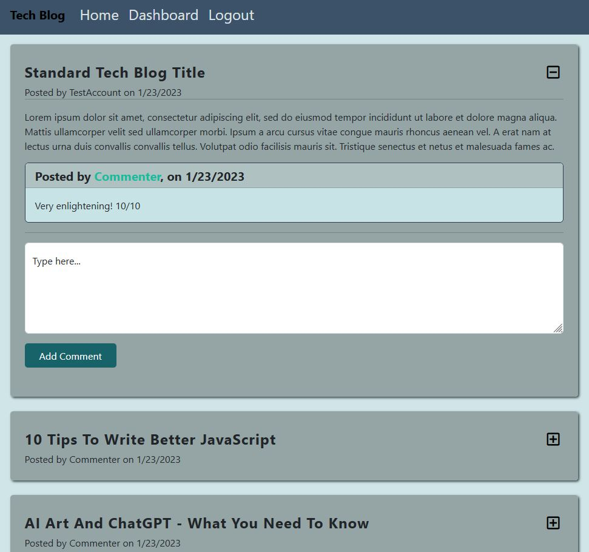
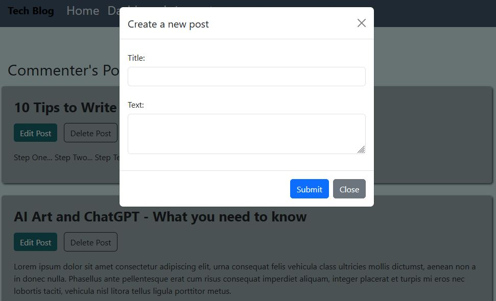

Model-View-Controller (MVC): Tech Blog

- [link to live site](https://tech-blog-crud-app-15634.herokuapp.com/)

## Description

A blog site setup where developers and other tech savvy people can publish their blog posts and comment on other users' posts as well.

Deployed to Heroku, it follows the MVC paradigm in its architectural structure, using [express-handlebars](https://www.npmjs.com/package/express-handlebars) as the templating language, [Sequelize](https://www.npmjs.com/package/sequelize) as the ORM, and the [express-session](https://www.npmjs.com/package/express-session) npm package for authentication.

## Table of Contents

- [Preview](#preview)
- [Packages Used](#packages)
- [License](#license)
- [Questions](#questions)

## Preview

Home Page

Creating a new blog post from your dashboard

## Packages

Project put together using the following libraries/packages:

- [bcrypt](https://www.npmjs.com/package/bcrypt)
- [cors](https://www.npmjs.com/package/cors)
- [dotenv](https://www.npmjs.com/package/dotenv)
- [Express.js](https://expressjs.com/)
- [Express-handlebars](https://www.npmjs.com/package/express-handlebars)
- [Express-session](https://www.npmjs.com/package/express-session)
- [handlebars](https://handlebarsjs.com/)
- [mySql2](https://www.npmjs.com/package/mysql2)
- [Sequelize](https://sequelize.org/)

## License

For more information about the licensing of this project, please click on the badge above, or follow this link https://choosealicense.com/licenses/mit/

## Questions

How to get into contact with me?

[My Github Profile](https://github.com/Jon-Ledo)

Email : jonledo.code@gmail.com
